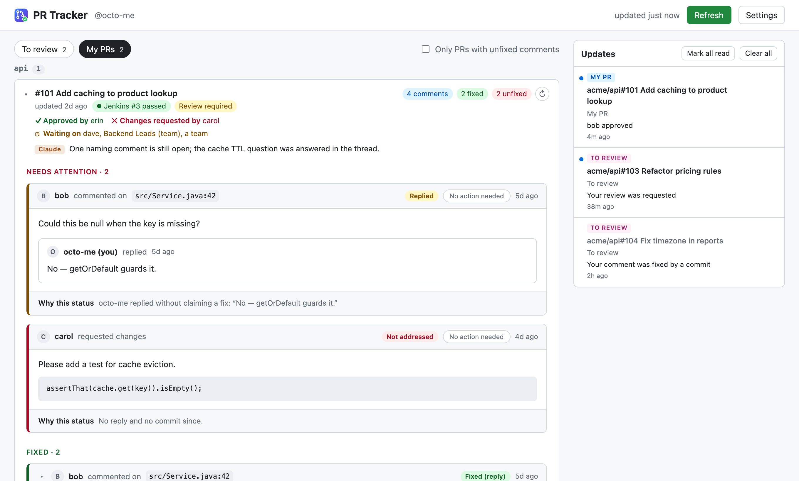

# PR Tracker

Click the toolbar icon to open a dashboard of **your open PRs** and **PRs waiting for your review** (review requested, open PRs you already reviewed, and open PRs in any *watched repositories* you list in Settings) on github.com. Each PR says whether any human (non-bot) has commented, lists those comments, and marks each one fixed or not:

| Status | Counts as | Evidence |
|---|---|---|
| Resolved | fixed | Review thread resolved (or review dismissed) |
| Fixed (reply) | fixed | PR author replied claiming a fix — "done", "fixed in abc123", "sudah diperbaiki" |
| Code changed | fixed | Thread is *outdated*: the commented lines changed afterwards |
| Replied | unfixed | Author replied but did not claim a fix (explained / pushed back) |
| Commit after | unfixed | A non-merge commit landed after the comment, nothing else |
| Not addressed | unfixed | No reply, no resolve, no commit since |
| No action needed | neither | An approval or clean review: "Verdict: Approve", "No blocking issues", "flagging as solid for a human reviewer". Needs a human approval, not a code change. Or you marked it yourself. |
| Optional | neither | Explicitly non-blocking: "Nit (non-blocking)", "Approve with suggestions" |

Anything that asks for a change ("before merge", "once … is addressed", "please fix", a blocking or critical note, Changes requested) stays actionable even if it also says something positive. Fixed, No action needed and Optional comments are folded to a one-line preview; click one to open it (it stays open until you fold it again). Heuristics miss sometimes, so every unfixed comment has a **No action needed** button, with Undo. Marks are kept in this browser across refreshes.

Bots are excluded: GitHub App accounts, `*[bot]`, plus any logins you list in Settings. The badge shows how many PRs have your review requested; it refreshes on a timer (default 15 min).

### Claude (optional)

Through Claude Code on your Mac (your Claude subscription; no API key), Claude judges each comment as **fixed**, **not fixed** or **no action needed** from the thread and the PR's commit list, and writes a one-line summary of what still blocks the PR, shown on its card. Statuses it decided say *· Claude* and the "Why this status" line gives its reason. GitHub's own facts are never overruled: a resolved thread or code changed under a comment keeps that status. The **No action needed** button still works on anything Claude leaves as not fixed.

**When Claude is asked.** Only when you click **Summarize with Claude** on a PR card — never on a refresh, whether you click Refresh, a card's ↻, or the background timer. The answer is stored and shown on every refresh; when the PR's comments, replies or commits change (or you pick another model) it stays visible, marked *outdated*, with **Summarize again**.

**Model:** Sonnet 5 by default; Opus 5.5, Opus 5 or Haiku 4.5 selectable in Settings → Claude summaries. The exact model you pick is used.

**How it runs.** The Claude Code helper (next section; install it and click Connect) runs `claude -p` headless for each PR, signed in as you, so it counts toward your Claude plan's usage. It runs with every tool off (`--tools ""`), no settings or MCP servers (`--setting-sources "" --strict-mcp-config`), no saved session (`--no-session-persistence`), in a scratch directory, with the PR text on stdin and JSON-schema output (`--json-schema`); about 15–20 s per PR. `install.sh` pins the `claude` path it finds on your PATH; re-run it after moving Claude Code. PR Tracker never reads or handles your Claude login itself.

**Company plans only.** Before every run the helper asks `claude auth status --json` which account Claude Code is signed in with, and refuses to send anything unless it's a **Team** or **Enterprise** plan, or Claude through your company's cloud (Bedrock, Vertex). A personal Pro/Max/free plan, a signed-out CLI, or an API key it can't place is refused with the fix (`claude` → `/logout` → `/login` with the company account). The check lives in the helper, so the page can't skip it; Settings → Claude summaries shows the account it found, and Summarize isn't offered while it's refused. Helpers older than v4 don't check, so summaries stay off until you re-run `install.sh`. **It sends comment text, file paths and commit messages to Anthropic** — check that's allowed for your repositories. Summarize shows up once the helper is connected; there is no API-key option (versions before 0.6 had one; a stored key is deleted on update).

### Claude Code sessions (optional)

PR cards can link to the Claude Code sessions on your machine that reviewed or discussed the PR. A **Claude Code · n** chip on the card; inside, each session with *Reviewed* / *Mentioned*, its title, project and time, and **Copy resume command** (`cd '<project>' && claude --resume <session-id>`; resuming is CLI-only, there's no deep link into the desktop app).

This needs a small local helper, because an extension can't read files:

```sh
sh native/install.sh <extension-id>          # the id and exact command are shown in Settings
sh native/install.sh <extension-id> --hook   # also mark reviews you post with Claude Code
sh native/install.sh --uninstall
```

then Settings → *Claude Code helper* → **Connect** (asks Chrome for `nativeMessaging`). The helper (`native/host.mjs`) is read-only: on each refresh it scans `~/.claude/projects/*/*.jsonl` for PR links and `gh pr … --repo …` commands (cached by file size and mtime, about 1 s cold, milliseconds after) and returns only session id, project folder, title and time. "Reviewed" means the session posted a review/comment (`gh pr review|comment`), ran `/code-review` or was asked to review that PR. PR Tracker's own repo is skipped. The transcript format is internal to Claude Code, so matching is best-effort and may need updating after Claude Code upgrades; transcripts are deleted after 30 days by default.

`--hook` adds a PreToolUse hook to `~/.claude/settings.json` (backed up first; your other hooks are kept) that appends `<!-- claude-code-session: <id> -->` to reviews and comments posted through `gh pr review|comment --body …` or GitHub MCP tools. It only rewrites the text; your permission prompt still decides. GitHub hides the marker when rendering, and PR Tracker shows a **Claude Code** tag on such comments — for anyone's, so teammates' Claude Code reviews are recognised too (a footer like "Generated with Claude Code" counts as well, without a session id).

### Tokens in the macOS Keychain (optional)

With the helper connected, Settings → Claude Code helper → *Keep the GitHub and Jenkins tokens in the macOS Keychain* moves both tokens out of Chrome's storage into your login Keychain (service `com.gdncomm.pr-tracker`, accounts `github` / `jenkins`). Chrome then stores only the placeholder `@keychain`; each refresh asks the helper for the token and uses it for that refresh only. The helper writes with `security -i`, so the token goes in on stdin and never appears in a process list; it accepts only the two names and token-shaped values. Unticking reads the tokens back into Chrome's storage and deletes the Keychain items.

What it protects: a copy or backup of your Chrome profile no longer contains the tokens, and they're encrypted at rest with your Mac login. What it doesn't: a program running as you can still read them (through the helper or `security`), as it could read Chrome's storage before. Refreshes fail with a clear message while the helper isn't reachable.

### Jenkins build

Jenkins reports each PR build to GitHub (a check run named "Jenkins CI"). The extension reads it from the PR's head commit, so no Jenkins login is needed, and shows a chip (e.g. **Jenkins #3 passed**, failed, running, queued) that links to the build. If several Jenkins jobs report, the worst one wins.

Test-automation repos (`cucumber-*`) never show Jenkins: no status, no link, no lookup and no build notifications, even when GitHub reports a build.

If GitHub hides builds from the token (fine-grained tokens may not see Jenkins check runs even with Commit statuses: Read), each PR gets a plain **Jenkins ↗** link to the CI Jenkins's search for the repo (`…/search/?q=<repo>`), since without a Jenkins token the repo's team folder isn't known, and no banner nags about it.

Only the CI Jenkins (`jenkins-build-ci-2`) reports PR builds to GitHub. Deployment repos are run by other Jenkins instances that post nothing to PRs and don't let anonymous users list jobs. So they get a **Jenkins ↗** link to that Jenkins's search for the repo name (a unique match opens the job once you're signed in), with no status:

| Repo | Jenkins |
|---|---|
| `prod-infra-*` | `jenkins-prod-infra.gdn-app.com` |
| `prod-*` | `jenkins-prod-deploy.gdn-app.com` |
| `nonprod-*` | `jenkins-np-deploy.gdn-app.com` |

**Status straight from Jenkins (API token).** GitHub doesn't show Jenkins check runs to fine-grained tokens, so pass/fail comes from Jenkins itself. Settings → *Jenkins API token* takes your Jenkins user ID and an API token (Jenkins → your name → Security/Configure → API Token → Add new token). Saving it asks Chrome for access to the Jenkins host (`*.gdn-app.com`). Each refresh then finds the repo's **team folder** — repos live under different teams (`GDN/TRFCEE`, `GDN/SEO`, … 84 folders): one request lists them all (~250 KB, cached for a day, re-listed within the hour when a PR's repo isn't in it), a repo in several folders is tried in each — and asks `…/job/GDN/job/<folder>/job/<repo>/job/PR-{number}/lastBuild/api/json` with HTTP Basic auth, at most 6 at a time. The browser's Jenkins session is never used. No job (404): no chip. A rejected token (401): red banner. Without a token, PRs show a plain **Jenkins ↗** link and a banner offers adding one. Jenkins tokens are not scoped: it carries your full Jenkins rights, though PR Tracker only reads with it. It's stored in `chrome.storage.local` like the GitHub token.

### Layout

**Refresh one PR:** the **↻** on each card fetches just that PR again (one small GraphQL request, under a second) — comments, approvals, Jenkins build, Claude Code sessions, and the stored Claude answer (marked outdated if the PR changed; never re-asked). A PR merged or closed meanwhile leaves the list with a note. Updates it brings (a new comment, an approval) reach the Updates panel and notifications like any refresh.

**Watched repositories** (Settings, up to 20; a bare name means `gdncomm/…`, a github.com URL works too) add every open, non-draft PR in those repos that you didn't write to *To review*, labelled *Watched repo*, so you see them even when nobody requests your review. The **Watched repos** checkbox above the list (To review tab) hides or shows them; the choice is remembered. A PR where you're a requested reviewer, or that you already reviewed, keeps that label and is never hidden by this filter. A new PR in a repo that was already watched also raises a *New PR* update.

Each tab is grouped by service (the repository name without `gdncomm/`). Order is "what needs me first": on *To review*, PRs you're on (review requested, or already reviewed by you) before PRs shown only because their repo is watched; then PRs carrying your own comments (your unfixed ones first; inside a PR your comments also lead each group); then PRs with unfixed comments, then PRs with comments (all fixed or no action needed), then PRs without human comments, newest update first within each. Groups follow their most urgent PR, except deployment repos (`prod-*`, `nonprod-*`), which always come after the services. Comments you mark *No action needed* stop counting as unfixed for sorting too. PRs with no activity for more than 7 days (GitHub's `updatedAt`: any push, comment or review) move to a collapsed **Stale** group at the bottom.

**Approvals (My PRs):** each card says who approved (**✓ Approved by**), who asked for changes (**✕ Changes requested by**) and whose review is still pending (**◷ Waiting on**, users and teams by name, e.g. *SRE-AUTOMATION-NONPROD (team)*), from GitHub's latest review per reviewer with write access and the open review requests. Bots are left out. A team hidden from a fine-grained token shows as "a team"; giving the token *Organization permissions → Members: Read-only* should reveal its name. With nobody requested and nothing reviewed it says *No reviewer requested yet*.

**Loading:** each list (My PRs, review requests, PRs you reviewed, watched repos) is its own GitHub request, in parallel — together they're heavy enough that GitHub sometimes answers *504: We couldn't respond to your request in time*. A timed-out or failed request is retried twice (after 1 s and 3 s); if one list still fails, the others are shown with a warning saying which one is missing, and only a failure of every list shows an error.

### Updates panel

Every detected update (below) is also kept in an **Updates** panel on the right: newest first, unread marked with a dot and counted in the header, last 100 kept. Clicking one opens it on GitHub and marks it read; the **✓** on hover marks it read without opening it; *Mark all read* clears the count; *Clear all* (click twice: the first click asks *Delete n?*) deletes every update and any desktop notifications still on screen. Each update is tagged **My PR** or **To review** (desktop notifications say the same in their context line), and the **×** on hover deletes it. On windows narrower than 1100px the panel becomes a drawer behind the header's **Updates** button. The panel records updates even when desktop notifications are off.

### Notifications

On each refresh the new snapshot is diffed against the previous one, and a desktop notification is raised for:

- **My PRs:** a new human comment, a reviewer following up in an existing thread, the PR becoming Approved or Changes requested, the Jenkins build failing (and passing again after a failure)
- **PRs I review:** a new review request; one of *my* comments getting fixed (resolved / code changed / "done" reply) or answered by the author

Clicking a notification opens that comment on GitHub. More than 4 updates at once collapse into one summary that opens the dashboard. The first fetch after install never notifies. Switch off in Settings. On macOS, Chrome itself must be allowed to notify (System Settings → Notifications → Google Chrome).



## Setup

1. Create a **fine-grained** token with Resource owner **gdncomm** ([pre-filled link](https://github.com/settings/personal-access-tokens/new?name=PR+Tracker&description=Read-only+PR+dashboard&target_name=gdncomm&expires_in=90&pull_requests=read&contents=read&statuses=read)):
   - Repository access: **All repositories**
   - Permissions: **Pull requests**, **Contents** and **Commit statuses**, all Read-only (Metadata is automatic). Commit statuses is what shows the Jenkins build.
2. If the org requires approval, wait until the token is no longer **pending**. No "Configure SSO" step is needed for fine-grained tokens.
3. Open PR Tracker → Settings → paste it → Save.

Only gdncomm repositories are covered: a fine-grained token has a single resource owner. A classic `repo` token also works (authorize it for SSO), but it grants far more than this read-only dashboard needs. It is stored only in this browser (`chrome.storage.local`, or the macOS Keychain — below) and sent only to `api.github.com`.

### Optional

- **Jenkins pass/fail:** Jenkins → your name → Security / Configure → API Token → *Add new token*; paste it with your user ID in Settings and accept Chrome's `*.gdn-app.com` prompt.
- **Claude Code helper** (sessions, Summarize, Keychain; needs Node.js and Claude Code):
  1. `claude auth status --text` should show a **Team** or **Enterprise** plan (for Summarize); otherwise `claude` → `/logout` → `/login` with the company account.
  2. Run the install command from Settings → Claude Code helper, from this folder: `sh native/install.sh <extension-id> [--hook]`.
  3. Settings → Claude Code helper → **Connect**. It should say *Connected* and, under Claude summaries, *Team plan · … — summaries allowed*.
  4. Optionally tick *Keep the GitHub and Jenkins tokens in the macOS Keychain* → Save.
- **Updating:** unzip over the same folder, reload the card at `chrome://extensions`, and re-run the helper's install command (Settings says when it's out of date).

## Install

No build step — the extension is plain ES modules and loads as it sits.

1. `chrome://extensions` → **Developer mode** → **Load unpacked** → this directory
2. Reload from the card after changing `manifest.json` or `background.js`

## Development

```sh
npm install
npm test            # unit tests — no browser needed
node tools/verify-claude.mjs   # Claude judging, through the real helper and a stand-in claude CLI
node tools/verify-sessions.mjs # the native helper end to end: sessions + Summarize via a stand-in claude CLI
node tools/make-screenshot.mjs # regenerate docs/screenshot.png (sample data)
npm run typecheck   # JSDoc types via tsc --noEmit; nothing is compiled
npm run verify      # loads the extension into a real Chromium and drives it (incl. tools/verify-jenkins.mjs)
npm run package     # Web Store zip
```

`npm run verify` is the one that catches what unit tests cannot: a manifest that
does not parse, a service worker that failed to register, a page whose modules
never loaded, or CSS that quietly defeated `element.hidden`.

## Permissions

| Permission | Why it is needed |
|---|---|
| `storage` | Token, settings, and the last fetched snapshot |
| `alarms` | Periodic refresh for the badge and notifications |
| `notifications` | Desktop alerts for new comments, approvals, review requests and fixes |
| host `https://api.github.com/*` | The one GraphQL call that fetches the PRs |
| optional host `https://*.gdn-app.com/*` | Only once you save a Jenkins API token: reads each PR's last build from Jenkins with it |

## Limits

- Top 30 most recently updated PRs per list; per PR, the last 50 commits, first 50 threads / reviews / comments.
- "Fixed" is inferred, not proven. Commit timestamps are commit dates, so a rebase can move them.

## Real-data check

```sh
gh api graphql --input <(node tools/print-query.mjs) > /tmp/dashboard.json
FIXTURE=/tmp/dashboard.json npm run verify
```

The icon is drawn in `icons/icon.svg`; after editing it, run `node tools/make-icons.mjs` to regenerate the PNGs.
